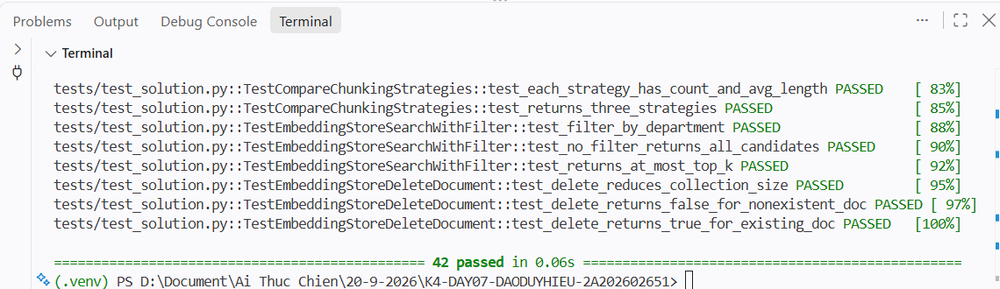

# Báo Cáo Cá Nhân — Lab 7: Embedding & Vector Store

**Họ tên:** Đào Duy Hiếu
**Nhóm:** G11
**Ngày:** 20/09/2026

> **Nộp 1 bản / sinh viên.** Phần nhóm (lựa chọn tài liệu, thiết kế chiến lược, bộ câu hỏi đánh giá, demo) nộp chung 1 bản trong `REPORT_NHOM.md`. Chi tiết thang điểm: `docs/SCORING.md`.

**Tổng điểm phần cá nhân: 60** = Khởi động (5) + Hướng tiếp cận (10) + Hoàn thiện code (30) + Dự đoán độ tương tự (5) + Kết quả truy xuất của tôi (10).

---

## 1. Khởi động (Warm-up) — Cá nhân (5 điểm)

### Độ tương tự Cosine (Cosine Similarity) (Bài tập 1.1)

**Độ tương tự cosine cao (High cosine similarity) nghĩa là gì?**
> Hai embedding có hướng gần nhau, nên hai đoạn văn có ý nghĩa hoặc ngữ cảnh gần nhau. Điểm càng gần 1 thì mức độ tương đồng ngữ nghĩa càng cao.

**Ví dụ có độ tương tự CAO:**
- Câu A: Tôi muốn đổi chiếc laptop bị lỗi ngay sau khi nhận hàng.
- Câu B: Khách mua cần thay sản phẩm máy tính bị hỏng trong thời gian đầu.
- Tại sao tương đồng: Hai câu dùng từ khác nhau nhưng đều nói về yêu cầu đổi một máy tính bị lỗi sau khi mua.

**Ví dụ có độ tương tự THẤP:**
- Câu A: Chính sách bảo hành yêu cầu giữ nguyên tem niêm phong.
- Câu B: Hà Nội hôm nay có mưa lớn vào buổi chiều.
- Tại sao khác: Hai câu thuộc hai chủ đề và mục đích thông tin không liên quan.

**Tại sao độ tương tự cosine (cosine similarity) được ưu tiên hơn khoảng cách Euclid (Euclidean distance) cho text embeddings?**
> Cosine so sánh hướng của vector nên tập trung vào quan hệ ngữ nghĩa và ít bị ảnh hưởng bởi độ lớn vector. Với embedding văn bản thường được chuẩn hóa, cosine phản ánh mức gần nhau về nghĩa trực tiếp hơn Euclid.

### Bài toán tính toán Chunking (Bài tập 1.2)

**Tài liệu 10,000 ký tự, chunk_size=500, overlap=50. Bao nhiêu chunks?**
> *Trình bày phép tính:* `ceil((10000 - 50) / (500 - 50)) = ceil(9950 / 450) = 23`.
>
> *Đáp án:* 23 chunks. Kiểm tra lại bằng `FixedSizeChunker(chunk_size=500, overlap=50)` với chuỗi 10.000 ký tự cũng cho 23.

**Nếu độ chồng chéo (overlap) tăng lên 100, số lượng chunk thay đổi thế nào? Tại sao muốn độ chồng chéo nhiều hơn?**
> Khi overlap là 100, số chunk là `ceil((10000 - 100) / (500 - 100)) = ceil(9900 / 400) = 25`, tăng từ 23 lên 25. Overlap lớn hơn giữ được ngữ cảnh nằm ở ranh giới hai chunk, nhưng làm tăng số vector cần tạo và lưu trữ.

---

## 2. Hướng tiếp cận của tôi (My Approach) — Cá nhân (10 điểm)

Giải thích cách tiếp cận của bạn khi lập trình (implement) các phần chính trong gói `src`.

### Các hàm chia nhỏ (Chunking Functions)

**`SentenceChunker.chunk`** — hướng tiếp cận:
> Tôi dùng `re.split(r"(?<=[.!?])\s+", text.strip())` để tách tại vị trí sau dấu kết thúc câu, vì lookbehind giữ lại dấu câu trong chunk. Text rỗng hoặc chỉ có khoảng trắng trả về `[]`; các câu sau đó được gom theo `max_sentences_per_chunk` và strip khoảng trắng thừa.
>
> Cách tách này chưa xử lý hoàn hảo chữ viết tắt như `TS.`, `v.v.` hoặc số thập phân, vì dấu chấm trong các trường hợp đó vẫn có thể bị hiểu là hết câu.

**`RecursiveChunker.chunk` / `_split`** — hướng tiếp cận:
> Thuật toán thử lần lượt `\n\n`, `\n`, `. `, khoảng trắng và cuối cùng là chuỗi rỗng. Mảnh dài hơn `chunk_size` được gọi đệ quy với separator nhỏ hơn; các mảnh nhỏ kề nhau lại được gom đến gần ngưỡng để tránh sinh ra quá nhiều chunk vụn.
>
> Base case là mảnh đã đủ ngắn, không còn separator, hoặc separator rỗng. Hai trường hợp cuối chuyển sang cắt cứng bằng `FixedSizeChunker` với overlap bằng 0 để luôn kết thúc an toàn.

### Lớp EmbeddingStore

**`add_documents` + `search`** — hướng tiếp cận:
> Mỗi `Document` được chuẩn hóa thành một record in-memory gồm `id`, `content`, bản sao `metadata` và `embedding`. `search` embed câu hỏi, tính dot product với embedding của mọi record, sắp xếp giảm dần theo score rồi trả tối đa `top_k` kết quả; embedding không được đưa ra output để tránh làm bẩn kết quả.

**`search_with_filter` + `delete_document`** — hướng tiếp cận:
> `search_with_filter` lọc metadata trước rồi mới gọi chung helper search, nên các slot top-k không bị tài liệu sai đối tượng chiếm mất. `delete_document` so sánh `metadata['doc_id']`, loại toàn bộ chunk thuộc file gốc và trả về `True` khi có ít nhất một record bị xóa.

### Tác tử KnowledgeBaseAgent

**`answer`** — hướng tiếp cận:
> Agent lấy top-k chunk trước, đánh số `[1]`, `[2]`, `[3]` và ghi nguồn của từng chunk trong prompt. Prompt yêu cầu LLM chỉ dùng ngữ cảnh được cung cấp, trích dẫn số chunk khi dùng thông tin và nói rõ khi không tìm thấy câu trả lời; store rỗng trả thông báo ngay mà không gọi LLM.

---

## 3. Hoàn thiện code (Core Implementation) — Cá nhân (30 điểm)

Vượt qua bộ kiểm thử là điều kiện tính điểm phần này.

### Kết Quả Kiểm Thử (Test Results)

```
# Dán kết quả (output) của: pytest tests/ -v
```



**Số lượng bài test vượt qua (pass):** 42 / 42

---

## 4. Dự đoán độ tương tự (Similarity Predictions) — Cá nhân (5 điểm)

| Cặp | Câu A | Câu B | Dự đoán | Điểm thực tế | Đúng? |
|------|-----------|-----------|---------|--------------|-------|
| 1 | Khách hàng muốn đổi máy tính bị lỗi sau khi mua. | Người mua cần thay sản phẩm bị hỏng trong thời gian đầu. | cao | 0.061 | Không |
| 2 | Sản phẩm còn tem niêm phong thì được bảo hành. | Điều kiện bảo hành yêu cầu tem của sản phẩm còn nguyên. | cao | -0.128 | Không |
| 3 | Người bán không phải trả phí đồng kiểm. | Nhà bán hàng được miễn chi phí cho đơn đồng kiểm. | cao | -0.098 | Không |
| 4 | Chính sách giao hàng miễn phí cho đơn đủ điều kiện. | Hôm nay trời mưa lớn ở Hà Nội. | thấp | 0.292 | Không |
| 5 | Đồ chơi lỗi kỹ thuật được đổi trong 30 ngày. | Khách hàng cần quay video khi mở gói hàng. | thấp | -0.032 | Có |

**Kết quả nào bất ngờ nhất? Điều này nói gì về cách embeddings biểu diễn ý nghĩa?**
> Cặp 3 có cùng nghĩa rõ ràng nhưng lại cho điểm âm, trong khi cặp 4 khác chủ đề lại có điểm dương cao hơn. Điều này không phản ánh khả năng của embedding ngữ nghĩa; nguyên nhân là `MockEmbedder` tạo vector từ MD5 của chuỗi, nên không thể dùng các điểm trên để suy luận về nghĩa văn bản.

---

## 5. Kết quả truy xuất của tôi (Competition Results) — Cá nhân (10 điểm)

Chạy **5 câu hỏi đánh giá của nhóm** trên mã nguồn cá nhân của bạn trong gói `src`. **5 câu hỏi này phải trùng với các thành viên cùng nhóm** (xem `REPORT_NHOM.md`).

| # | Câu hỏi (Query) | Top-1 Chunk truy xuất được (tóm tắt) | Điểm Score | Có liên quan không? (Relevant) | Câu trả lời của Agent (tóm tắt) |
|---|-------|--------------------------------|-------|-----------|------------------------|
| 1 | Shopee: thời hạn Trả hàng/Hoàn tiền và gửi lại hàng | Chunk về đổi phụ kiện tại Điện Máy Xanh; không có mốc 15 ngày/6 ngày của Shopee. | 0.237 | Không | Agent mock không thể trả lời đáng tin cậy vì ngữ cảnh top-1 sai nguồn. |
| 2 | Lazada: chi phí đồng kiểm và nơi liên hệ của NBH | FAQ Lazada về người mua tiếp tục yêu cầu trả hàng/hoàn tiền; không trực tiếp trả lời hai ý hỏi. Top-3 có chunk `lazada-joint-inspection-seller#1` chứa gold answer. | 0.159 | Top-1: không; Top-3: có | Khi dùng đúng chunk top-3, câu trả lời là NBH không trả thêm phí và liên hệ Bộ phận Hỗ trợ NBH PSC. |
| 3 | HACOM: 15 ngày đổi mới và bảo hành tận nơi | Chunk mở đầu chính sách đổi trả Shopee, không có điều kiện Thẻ bảo hành vàng hoặc phạm vi 20 km. | 0.251 | Không | Agent mock không có ngữ cảnh HACOM cần thiết nên không thể kết luận đúng. |
| 4 | Điện Máy Xanh: thời hạn trả hàng và bằng chứng video | Chunk về trách nhiệm người bán/sàn tại Điện Máy Xanh; đúng nền tảng nhưng thiếu mốc 15 ngày và yêu cầu video. | 0.303 | Không đủ | Không chấm là trả lời đúng vì ngữ cảnh top-1 không chứa các chi tiết gold answer. |
| 5 | AVAKids: đổi trả đồ chơi lỗi kỹ thuật và bảo hành | Chunk về phụ kiện của Điện Máy Xanh, không nói về đồ chơi AVAKids. Gold document xuất hiện ở top-2 nhưng chunk đó là mục đồ dùng cho bé, không phải đồ chơi. | 0.235 | Không | Agent mock không có bằng chứng đủ cho câu trả lời 30 ngày và không bảo hành. |

**Bao nhiêu câu hỏi trả về chunk có liên quan trong top-3?** 1 / 5

> Benchmark dùng `MockEmbedder` mặc định. Backend này sinh vector từ MD5 nên không mã hóa ngữ nghĩa; vì vậy các score và thứ hạng ở bảng trên chỉ dùng để minh họa luồng benchmark, không dùng để kết luận chất lượng retrieval. Chưa cài được local/OpenAI/Gemini embedding thật, nên phần trả lời của agent cũng không được chấm cao.

**Điều hay nhất tôi học được từ thành viên khác / nhóm khác (qua demo):**
> Cần kiểm tra nội dung thực sự nằm trong chunk, không chỉ kiểm `doc_id` của tài liệu gold xuất hiện ở top-3. Bộ lọc metadata cho q2 cũng cho thấy lọc trước khi search giúp giới hạn đúng đối tượng Nhà Bán Hàng, dù embedding mock vẫn xếp thứ hạng chưa tốt.

---

## Tự Đánh Giá (Phần Cá Nhân)

| Tiêu chí | Điểm tự đánh giá |
|----------|-------------------|
| Khởi động (Warm-up) | 5 / 5 |
| Hướng tiếp cận của tôi (My Approach) | 10 / 10 |
| Hoàn thiện code (Core Implementation — tests) | 30 / 30 |
| Dự đoán độ tương tự (Similarity Predictions) | 4 / 5 |
| Kết quả truy xuất của tôi (Competition Results) | 1 / 10 |
| **Tổng phần cá nhân** | **50 / 60** |
